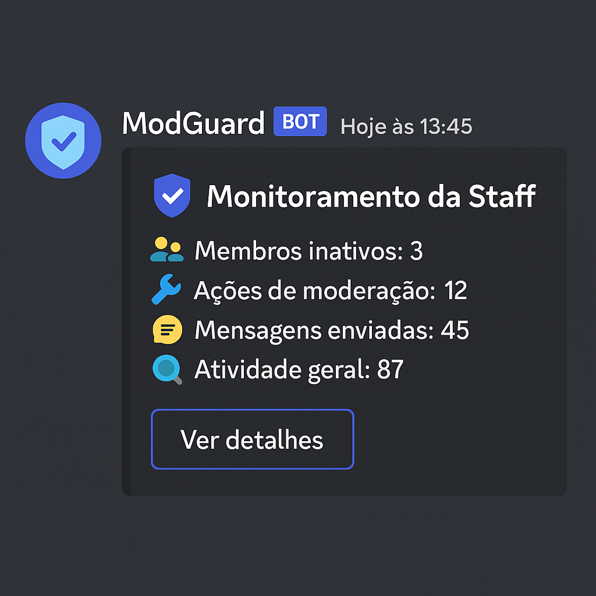

# 🛡️ ModGuard

> Monitoramento inteligente da staff! Detecte inatividade, registre ações e mantenha o controle da moderação.

[](https://twitter.com/t_h_e_u)
[](https://www.linkedin.com/in/matheusgbatista/)
[](https://t-heu.github.io)

---

## 📌 Sobre o projeto

O **ModGuard** é um bot de Discord focado na **moderação inteligente**. Ele registra atividades, detecta inatividade da staff e automatiza processos de controle em servidores. Além disso, possui um sistema de **auto cargos por reação**, comandos divertidos e ferramentas úteis para administradores.

> Atualmente usado no servidor **Lobby BR**, um espaço que conecta gamers de todos os tipos.


### 📦 Preview



---

## 🧠 Funcionalidades

- 🔧 **Comandos com prefixo `!`**: Várias interações com usuários e administração.
- 📊 **Monitoramento de staff**: Detecta inatividade e registra eventos de moderação.
- 🎭 **Sistema de reações**: Atribui cargos com base em emojis.
- ⚙️ **Comandos administrativos**: Setup de cargos via mensagens reativas.

---

## ⚡ Pré-requisitos

- [Node.js](https://nodejs.org/) (recomendado: v16+)
- [Discord.js](https://discord.js.org/)
- Permissões adequadas para o bot no seu servidor

---

## 🧰 Tecnologias e Ferramentas


---

## 📦 Instalação

```bash
# 1. Clone o repositório
git clone https://github.com/t-heu/modguard.git
cd bot_discord

# 2. Instale as dependências
npm install

# 3. Configure o .env
cp .env.example .env
# Adicione o token:
TOKEN_BOT_SECRET=seu-token-aqui

# 4. Inicie o bot
npm run dev
```

Link: https://discord.com/oauth2/authorize?client_id=1393966941236101190
